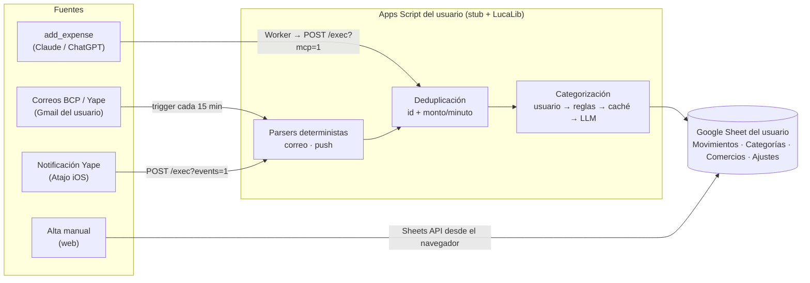
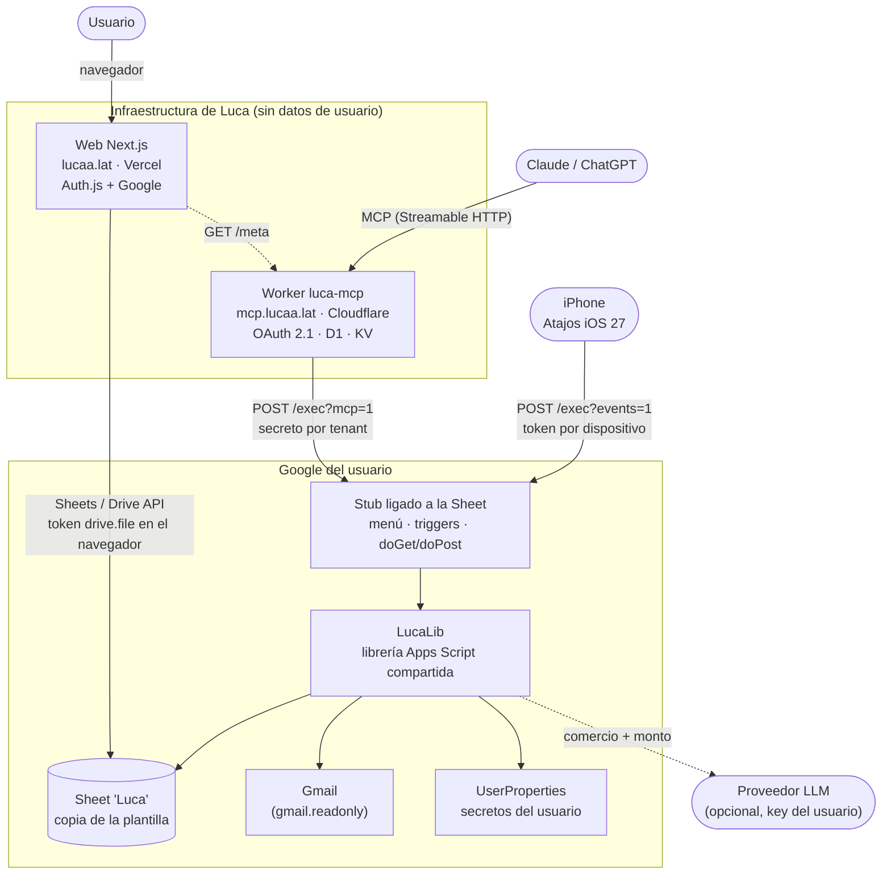
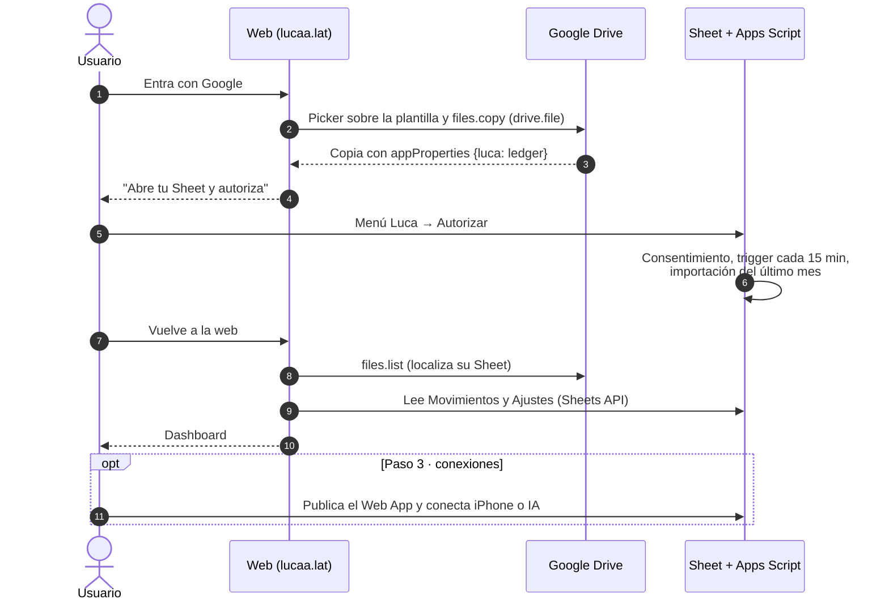
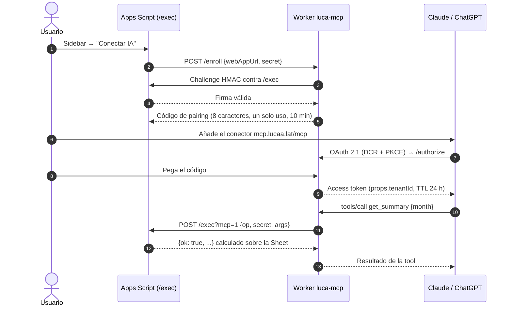

> **Copia personal.** Este repositorio es una copia de
> [JosephRobles23/luca](https://github.com/JosephRobles23/luca) ([lucaa.lat](https://lucaa.lat)),
> creado por Joseph Robles y distribuido bajo licencia MIT.
> El historial de commits y el archivo [`LICENSE`](LICENSE) originales se conservan sin cambios.
> Todo el crédito del trabajo original es de su autor.

<p align="center">
  
</p>

<h1 align="center">Luca</h1>

<p align="center">
  Tus gastos de BCP y Yape, ordenados en <b>tu</b> Google Sheet. Gratis, sin base de datos y sin configurar nubes.
</p>

<p align="center">
  <a href="https://lucaa.lat">lucaa.lat</a> ·
  <a href="#cómo-funciona">Cómo funciona</a> ·
  <a href="#arquitectura">Arquitectura</a> ·
  <a href="#desarrollo">Desarrollo</a> ·
  <a href="CONTRIBUTING.md">Contribuir</a> ·
  <a href="SECURITY.md">Seguridad</a>
</p>

<p align="center">
  <a href="LICENSE"></a>
  
  
  
  
  
</p>

---

Luca lee los correos de notificación de **BCP** y **Yape** que ya llegan a tu Gmail, los convierte en movimientos
normalizados y categorizados dentro de una **Google Sheet que es tuya**, y te los muestra en un dashboard web.
Opcionalmente captura los yapeos recibidos desde las notificaciones del **iPhone** y te deja consultar o registrar
gastos desde **Claude o ChatGPT** mediante un servidor **MCP**.

> **Principio rector: los datos viven y se procesan en el Google del usuario.** Luca no guarda transacciones,
> tokens de Google ni claves de API en su infraestructura. La web no tiene base de datos.

## Demo en video

<table>
  <tr>
    <td width="50%" align="center">
      <a href="https://pub-9c0cbd6f24354fc589d1b895be70355d.r2.dev/luca-video/luca-demo-narrado.mp4"></a>
    </td>
    <td width="50%" align="center">
      <a href="https://pub-9c0cbd6f24354fc589d1b895be70355d.r2.dev/luca-video/luca-pitch-mujer.mp4"></a>
    </td>
  </tr>
  <tr>
    <td valign="top">
      <b><a href="https://pub-9c0cbd6f24354fc589d1b895be70355d.r2.dev/luca-video/luca-demo-narrado.mp4">Demo narrado · 3:52</a></b><br>
      El producto real de punta a punta: copiar la plantilla, el panel en lucaa.lat, el dashboard dentro de la Sheet,
      las conexiones y el conector MCP preguntándole a ChatGPT por tus gastos.
    </td>
    <td valign="top">
      <b><a href="https://pub-9c0cbd6f24354fc589d1b895be70355d.r2.dev/luca-video/luca-pitch-mujer.mp4">Pitch · 2:22</a></b><br>
      La idea en dos minutos: tu Sheet es la base de datos, tu Google es el backend y la web solo renderiza.
      Animación generada por código, cuadro a cuadro.
    </td>
  </tr>
</table>

## Tabla de contenidos

- [Demo en video](#demo-en-video)
- [Características](#características)
- [Cómo funciona](#cómo-funciona)
- [Arquitectura](#arquitectura)
- [Privacidad y modelo de seguridad](#privacidad-y-modelo-de-seguridad)
- [Empezar como usuario](#empezar-como-usuario)
- [Desarrollo](#desarrollo)
- [Estructura del repositorio](#estructura-del-repositorio)
- [Releases](#releases)
- [Documentación](#documentación)
- [Contribuir](#contribuir)
- [Licencia](#licencia)

## Características

- **Ingesta automática desde Gmail**: parsers deterministas para 9 tipos de correo de BCP y Yape (consumos con
  tarjeta, transferencias, pagos con QR, servicios, recargas, yapeos…), con escaneo cada 15 minutos e
  importación histórica reanudable.
- **Categorización en cascada**: elección del usuario → reglas → caché de comercios aprendida → LLM opcional.
  Al LLM solo le llega `comercio + monto` ([ADR-004](docs/architecture/adr-004-categorizacion-y-llm.md)).
- **Modelo de movimientos** con tipos (`expense`, `income`, `transfer_in`, `internal_transfer`…), P2P y
  multi-moneda PEN/USD ([ADR-005](docs/architecture/adr-005-modelo-de-movimientos.md)).
- **Web en [lucaa.lat](https://lucaa.lat)**: resumen del mes, categorías, tendencias de 6 meses, comercios
  principales, recategorización, alta manual y gestión de conexiones. Lee y escribe la Sheet **desde el navegador**.
- **Dentro de Google Sheets**: menú Luca, panel lateral, guía paso a paso y Dashboard con gráficos SVG.
- **iPhone (iOS 27)**: un atajo envía los yapeos recibidos **directo** a tu Apps Script, sin pasar por Luca
  ([ADR-003](docs/architecture/adr-003-canal-iphone-directo.md)).
- **Conector MCP** para Claude y ChatGPT: `get_summary`, `category_breakdown`, `top_merchants`,
  `list_transactions`, `budget_status` y `add_expense` ([services/luca-mcp](services/luca-mcp/README.md)).
- **Extractor LLM opt-in** para correos no reconocidos, que recibe el texto enmascarado
  ([ADR-008](docs/architecture/adr-008-extractor-llm-opt-in.md)).

## Cómo funciona

Cada usuario tiene **su propia copia** de una Sheet plantilla. Esa copia lleva un script ligado (el *stub*) que
delega toda la lógica en una librería compartida de Apps Script (**LucaLib**). El script corre **con la identidad
del usuario** y es el único componente que toca Gmail y los montos.



## Arquitectura

### Vista de componentes



| Componente | Tecnología | Qué guarda |
|---|---|---|
| **LucaLib** (`gas/shared`) | Google Apps Script | Nada propio: escribe en la Sheet y en `UserProperties` del usuario |
| **Stub** (`gas/stub`) | Apps Script ligado a la plantilla | Triggers y `doGet`/`doPost` del proyecto contenedor |
| **Web** (`apps/web`) | Next.js 16, React 19, Auth.js v5, Tailwind 4 | Nada en servidor: tokens de Google solo en la cookie JWT cifrada |
| **Worker** (`services/luca-mcp`) | Cloudflare Workers, `workers-oauth-provider`, `agents`, D1, KV | `tenantId → {execUrl, secreto}` y códigos de pairing con TTL; estado OAuth |

Las decisiones de arquitectura están en [`docs/architecture/`](docs/architecture/) (ADR-001…008).

### Onboarding en tres pasos



### Conector MCP: pairing y llamada a una tool

El Worker es un **relevo sin estado de datos**: traduce MCP a una llamada al Web App del usuario y no ve ni guarda
movimientos ([ADR-001](docs/architecture/adr-001-acceso-mcp-a-datos.md)).



## Privacidad y modelo de seguridad

- **Sin base de datos de usuarios.** El vínculo usuario ↔ Sheet lo resuelve Drive (`appProperties`); la web solo
  refresca tokens que viven en la cookie cifrada del usuario ([ADR-006](docs/architecture/adr-006-web-y-onboarding.md)).
- **Permisos mínimos.** La web usa `drive.file` (solo los archivos que Luca crea o que el usuario elige). El script
  del usuario usa `gmail.readonly` para leer notificaciones bancarias.
- **Secretos por usuario** en `PropertiesService.getUserProperties()` de su propio script: API key del LLM, token
  del iPhone y secreto del conector MCP. Nunca en las Script Properties de la librería.
- **El Worker no ve movimientos.** Guarda solo `tenantId → {execUrl, secreto}` y códigos de pairing que expiran.
- **LLM opcional y acotado.** Solo `comercio + monto`; el extractor de correos desconocidos es opt-in y enmascara el
  texto antes de enviarlo.
- **Sin analítica ni rastreadores.**

¿Encontraste una vulnerabilidad? Repórtala en privado según [SECURITY.md](SECURITY.md).

## Empezar como usuario

1. Entra en **[lucaa.lat](https://lucaa.lat)** con tu cuenta de Google y pulsa **Crear mi Sheet**. Se copia la
   plantilla a tu Drive.
2. Abre la Sheet → menú **Luca → Autorizar** y acepta los permisos. Luca importa el último mes y queda escaneando
   cada 15 minutos.
3. Vuelve a la web para ver tu dashboard. Opcional: **Activar conexiones** para el iPhone
   ([guía](docs/guides/guia-atajos-ios27-yape.md)) y para tu IA (código de pairing → conector MCP).

No necesitas cuenta de GCP ni configurar ninguna nube.

## Desarrollo

### Requisitos

- Node.js ≥ 20 y npm.
- Para publicar LucaLib o el stub: [`clasp`](https://github.com/google/clasp) autenticado.
- Para el Worker: [`wrangler`](https://developers.cloudflare.com/workers/wrangler/) (se instala con el paquete).
- Para la web en local: un cliente OAuth de Google y `apps/web/.env.local` (copia de
  [`apps/web/.env.example`](apps/web/.env.example)). Guía: [`docs/guides/guia-dns-vercel-oauth.md`](docs/guides/guia-dns-vercel-oauth.md).

### Puesta en marcha

```bash
git clone https://github.com/JosephRobles23/luca.git
cd luca
npm install --prefix apps/web
npm install --prefix services/luca-mcp

npm test                          # tests Node: Apps Script (harness vm), lógica web y Worker
npm run web:dev                   # web en http://localhost:3000 (necesita apps/web/.env.local)
npm run dev:mock --prefix apps/web  # web con datos simulados, sin Google (LUCA_MOCK=1)
```

`npm test` no toca Google: las pruebas de Apps Script corren en un sandbox `vm` de Node con mocks de los servicios
(`tests/gas-harness.mjs`) y fixtures de correo sintéticos y anonimizados.

### Comandos

| Comando | Qué hace |
|---|---|
| `npm test` | Todos los tests unitarios (Apps Script, web y Worker) |
| `npm run e2e --prefix apps/web` | E2E con Playwright sobre la web en modo mock |
| `npm run mcp:typecheck` | `tsc` del Worker |
| `npm run web:build` | Build de producción de la web |
| `npm run release:check` | Verifica que la versión de LucaLib coincide en los 4 sitios |
| `npm run lib:push` / `lib:version` | `clasp push` y nueva versión de LucaLib |
| `npm run stub:push` | `clasp push` del stub a la plantilla |
| `npm run mcp:deploy` | Despliega el Worker |

### Convenciones

- **Apps Script** (`gas/`): sin `import/export`; funciones privadas con sufijo `_`; toda llamada de la UI pasa por
  `lucaRun` → `dispatch` (lista blanca). Un archivo nuevo en `gas/shared` se añade a `RUNTIME_FILES` en
  `tests/gas-harness.mjs`.
- **Web**: lógica pura en `apps/web/src/lib/*.ts` con tests `.test.mjs`; los componentes solo presentan.
- **Parsers deterministas primero**; el LLM es siempre opcional.
- **Fixtures** sintéticos y anonimizados en `tests/fixtures`. Los correos reales nunca se versionan.

El detalle está en [CLAUDE.md](CLAUDE.md) (guía para agentes y colaboradores) y el vocabulario en [CONTEXT.md](CONTEXT.md).

## Estructura del repositorio

```text
gas/shared/          LucaLib: parsers, ledger, escaneo Gmail, categorización, LLM opcional, MCP, UI de la Sheet
gas/stub/            script ligado a la plantilla (bootloader delgado: menú, triggers, doGet/doPost)
apps/web/            web Next.js (lucaa.lat): login, onboarding, dashboard, conexiones; sin base de datos
services/luca-mcp/   Worker de Cloudflare (mcp.lucaa.lat): OAuth 2.1, pairing y tools MCP
scripts/             release-check, eml-check, build-previews
tests/               harness vm con mocks de Apps Script y fixtures sintéticos
spikes/              experimentos de validación (S1–S7) y sus resultados
docs/                arquitectura y ADRs, guías, research, discovery, estado del desarrollo
```

## Releases

Una release publica una versión nueva de LucaLib y repite su número en cuatro sitios (`LUCA_VERSION`, el manifiesto
del stub, `wrangler.toml` y `.env.example`). El procedimiento completo está en
[`.claude/skills/deploy-luca/SKILL.md`](.claude/skills/deploy-luca/SKILL.md).

Las copias existentes de los usuarios **no se actualizan solas**: la web y el panel de la Sheet avisan cuando hay
una versión nueva y muestran cómo subirla ([ADR-006 §5](docs/architecture/adr-006-web-y-onboarding.md)).

## Documentación

| Tema | Dónde |
|---|---|
| Arquitectura base, ADRs y plan | [`docs/architecture/`](docs/architecture/) |
| Estado del desarrollo | [`docs/dev/status.md`](docs/dev/status.md) |
| Formatos reales de correos BCP/Yape | [`docs/discovery/formatos-correos-bcp-yape.md`](docs/discovery/formatos-correos-bcp-yape.md) |
| DNS, Vercel y clientes OAuth | [`docs/guides/guia-dns-vercel-oauth.md`](docs/guides/guia-dns-vercel-oauth.md) |
| Consola de GCP (operador) | [`docs/guides/gcp-consola-oauth-luca.md`](docs/guides/gcp-consola-oauth-luca.md) |
| Captura de yapeos en iPhone | [`docs/guides/guia-atajos-ios27-yape.md`](docs/guides/guia-atajos-ios27-yape.md) |
| Servidor MCP | [`services/luca-mcp/README.md`](services/luca-mcp/README.md) |
| Sistema de diseño | [`DESIGN.md`](DESIGN.md) |
| Investigaciones con fuentes | [`docs/research/`](docs/research/) |

## Contribuir

Las contribuciones son bienvenidas. Lee [CONTRIBUTING.md](CONTRIBUTING.md) antes de abrir un PR. Las reglas que no se
negocian: los datos se quedan en el Google del usuario, el usuario final no configura ninguna nube y los secretos
nunca entran al repositorio.

## Licencia

[MIT](LICENSE) © 2026 Joseph Robles.

Luca no está afiliado a BCP, Yape, Google, Anthropic, OpenAI ni Cloudflare. Las marcas pertenecen a sus dueños.
